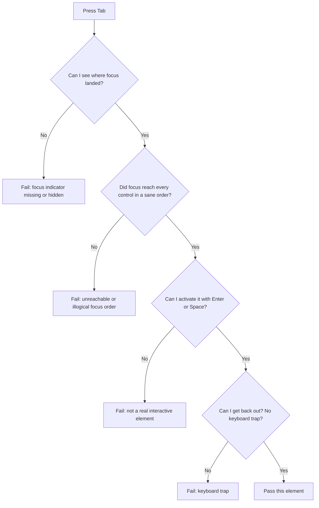

The [European Accessibility Act](https://commission.europa.eu/strategy-and-policy/policies/justice-and-fundamental-rights/disability/european-accessibility-act-eaa_en) turns one tomorrow. It took force on 28 June 2025. For many teams it was the first hard deadline they had ever faced for this work — e-commerce, banking, transport, ticketing, and telecom, across all 27 EU countries.

A year on, I see the same reflex. A team bolts a widget into the corner of the page: a floating icon that swears it fixes accessibility in one click. It does not. Here is why, and here is what I do instead.

### A widget is a sticker over a crack

Most accessibility lives in your markup and your CSS, not in a script you paste before `</body>`. A widget can recolor text or grow the font. It can not build a focus order your page never had. It can not teach a `<div onclick>` to behave like a `<button>`.

The Nielsen Norman Group has said this for years: accessibility is a mindset, not a checklist, and a bolted-on widget is not enough. The only real test is to put disabled users in front of the design. So drop the sticker. The best test costs nothing but a little pride.

### Unplug your mouse

I mean it. Pull the mouse out. Use your own site with the keyboard. Tab forward, `Shift+Tab` back, `Enter` and `Space` to act, `Esc` to close.

You will find the broken parts in a minute. A modal you can tab into but never out of. A dropdown the keyboard skips. A "button" that ignores `Enter` because it is a `<span>` in costume. The mouse hid all of it.

This is no fringe group. Some people drive the keyboard because their hands need it, some because a screen reader drives it for them, some because it is faster. Marieke McCloskey set the three rules a decade ago, and they still hold: keep focus visible, let the Tab key reach every control, and let users skip past long menus.

This is the check I run as I tab:



Three of those boxes catch most of what I find. None need a widget. They need markup.

### The dull CSS that does the work

[WCAG 2.2](https://www.w3.org/TR/WCAG22/) shipped on 5 October 2023 and added [nine new criteria](https://www.w3.org/WAI/standards-guidelines/wcag/new-in-22/). Most are dull. That is the point: they turn good intentions into numbers you can check.

Focus first. This is still the worst line of CSS on the web:

```css
/* Please don't. This blinds every keyboard user. */
:focus {
  outline: none;
}
```

People strip the ring because it looks untidy on a mouse click. Don't delete it — show it to the people who need it. The `:focus-visible` pseudo-class fires only when the browser judges a ring would help, which means keyboard use and not a stray click ([MDN](https://developer.mozilla.org/en-US/docs/Web/CSS/:focus-visible)).

```css
/* Quiet for mouse clicks, loud for keyboard users. */
:focus-visible {
  outline: 3px solid #1a73e8;
  outline-offset: 2px;
}
```

*Keyboard users get a clear ring. Mouse users see nothing on click. Nobody is stranded.* WCAG 2.2 even put numbers on it: [Focus Appearance](https://www.w3.org/WAI/WCAG22/Understanding/focus-appearance.html) wants a ring large and sharp enough to spot, and [Focus Not Obscured](https://www.w3.org/WAI/WCAG22/Understanding/focus-not-obscured-minimum.html) bars a sticky header from hiding it.

Now hit targets. [Target Size (Minimum)](https://www.w3.org/WAI/WCAG22/Understanding/target-size-minimum.html) asks for at least 24 by 24 CSS pixels, or enough space that a 24px circle on each does not touch its neighbor. This is for everyone who has missed a tiny close button.

```css
/* Small icon button? Give it a real target. */
.icon-button {
  min-width: 24px;
  min-height: 24px;
  display: inline-flex;
  align-items: center;
  justify-content: center;
}
```

Twenty-four pixels is the floor, not the goal. I go bigger for the main action. But it is a number, and a number is something a team can ship.

### Use the element, not the costume

The cheapest win is older than any guideline: use the right HTML. A real `<button>` takes focus, fires on `Enter` and `Space`, names itself to a screen reader, and joins the tab order for free. A `<div>` in costume gives you none of that until you wire up `tabindex`, key handlers, and an ARIA role by hand — and you will miss one.

```jsx
// A costume. Skips the tab order, ignores Enter, silent to screen readers.
<div className="btn" onClick={save}>Save</div>

// The real thing. Keyboard, focus, and semantics included.
<button type="button" className="btn" onClick={save}>Save</button>
```

Same pixels. Worlds apart for anyone off the mouse. I have deleted many clever components by swapping in the plain element that already worked.

### Why this beats the fine

The EAA carries real penalties, and within days of the deadline French groups sent legal notices to big retailers. The fines are a good reason to care. They are not my reason.

One in five people lives with a disability, and as many are neurodiverse. Build for them and the work pays everyone back — the parent holding a baby and a phone, the commuter in glare, the person whose trackpad just died. A focus ring helps the power user. A 24-pixel target helps every thumb. Here the edge case makes the center better.

The widget swears it skips all this. It can not. Your keyboard shows you the truth in a minute, and three lines of CSS fix most of what it shows.

### Start tomorrow morning

The Act turning one is a fine nudge. Unplug the mouse, tab through your top page, and note what breaks. Swap `outline: none` for `:focus-visible`. Give your small buttons 24 real pixels. Replace one fake button with a real one. Small, dull, and it stays fixed. That beats a sticker.

Happy (inclusive) building!
