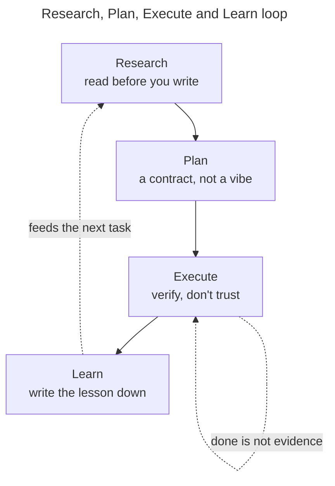

> "What goes into the agent before it runs decides what comes out." — a lesson I keep relearning.

A confession: give me a coding agent and a task, and I want to type the task and hit go. Research and planning feel like chores. There's a wire running straight from "I have an idea" to "build it," and I take it almost every time.

That wire is the red dashes in the picture up top. It feels fast. It rarely is.

This post walks through the loop that works for agent-assisted coding. Four phases: **Research, Plan, Execute, Learn**. My claim is simple — the phase everyone drops is the one that pays off most. And by pays off I mean it compounds: Learn feeds each session's lesson back into the agent, so every task you finish makes the next one cheaper. Skip it and you're stuck re-explaining the same things every morning. None of the rest depends on your tool either. It works in a terminal, an editor, or a browser tab.

<h2 id="shortcut">The shortcut nobody admits to</h2>

Agents are eager. Give one a task and it starts producing. That's the appeal, and the trap. Producing something and producing the right thing are two different events.

People who get good results haven't found better prompts. They've built a process around the agent instead of firing prompts at it. Anthropic's guidance says it plainly: [explore first, then plan, then code](https://code.claude.com/docs/en/best-practices), so you don't solve the wrong problem. Tyler Burleigh calls the same shape [Research, Plan, Implement, Review](https://tylerburleigh.com/blog/2026/02/22/). The [Tweag handbook](https://tweag.github.io/agentic-coding-handbook/) starts with exploration too.

Four names, one idea. Split the thinking from the typing. Then close the loop.

<h2 id="research">1. Research: read before you write</h2>

Research is the cheapest phase, and the first I skip. It's just this: before the agent changes anything, make it read.

Point it at the real files. Have it trace how the current code works. Ask what you'd ask a senior engineer in their second week — how does auth work, where do sessions live, what's the pattern for a new endpoint. You don't want code yet. You want the agent's context filled with your codebase so it stops guessing.

When an agent doesn't know your code, it fills the gap with the average of every codebase it has seen. That average produces the subtly-wrong output. Research swaps the average for your specifics.

One guardrail: research sprawls. Tell an agent to "look into" something and it reads two hundred files and chokes. Scope it. "Read `src/auth` and the session middleware" beats "understand the app." If your tool has a separate research context, use it, so the reading doesn't crowd out the work.

<h2 id="plan">2. Plan: a plan is a contract, not a vibe</h2>

Once the agent has read enough, make it write a plan before code. On the page, where you can argue with it.

A good plan names the files it will touch, the shape of the change, what's out of scope, and how you'll know it worked. That last part carries the weight. A plan that ends with "here's how we verify it" is a contract. A plan that ends with "then I'll implement it" is a vibe.

I treat the plan as the real work. Get it right and the code is mechanical. Get it wrong and no clever code saves you — you get a finished-looking solution to the wrong problem, which beats a broken one at hiding.

A skeleton I reuse:

```markdown
## Goal
One sentence. What does "done" mean?

## Files to change
- src/foo.ts — add X
- src/foo.test.ts — cover the logged-out case
- src/good.example.ts - if doing similar job give it an example

## Out of scope
- Don't touch the billing flow
- No new dependencies without asking

## Verification
- `npm test` passes, including the new logged-out case
- Manual: hit /api/foo while signed out, expect 401
```

One section tells the agent what *not* to do. Agents drift toward the easiest thing to build. Boundaries on the plan stop the drift before it starts.

<h2 id="execute">3. Execute: let it check its own work</h2>

The fun part — the glowing "Execute" node, the one we all rush. It holds the one habit that matters most: **give the agent a check it can run, and never take "done" at face value.**

An agent will tell you it's finished, and sound sure. That sureness is generated text, not a status report. Anthropic's docs name it the "[trust-then-verify gap](https://code.claude.com/docs/en/best-practices)": the model writes a plausible implementation, declares success, and the edge cases quietly fail. In one documented run, an agent [declared success on 19 of 45 tasks whose hidden tests still failed](https://docs.bswen.com/blog/2026-06-25-ai-coding-agent-false-positive-failure/) — 42%, because it ran only the visible tests and never checked the rest. The model isn't lying. "Looks done" is just part of what it writes — pass or fail.

So close the loop. Hand it a check it runs itself — tests, a build, a linter, a script that diffs output. Now it works, runs the check, reads the failure, and fixes it, instead of handing you a guess. Ask for evidence, not the adjective:

```text
Implement the plan. Write a test for the logged-out case.
Run the suite and paste the actual output. Don't tell me it passed — show me.
```

Sometimes I add a Steps section if I want to have things done in order - I add the check there beforehand e.g. 

```markdown
## Steps
1. Create unit tests for X first
2. Implement X - make sure unit test passes
3. ...

```

A second failure earns its own line: invented dependencies. A [2025 USENIX Security study](https://www.usenix.org/publications/loginonline/we-have-package-you-comprehensive-analysis-package-hallucinations-code) found the coding models it tested recommended packages that don't exist about one in five times on average — near 21% for open-source models, closer to 5% for commercial ones — and the fake names repeat. That gap spawned an attack called ["slopsquatting"](https://socket.dev/blog/slopsquatting-how-ai-hallucinations-are-fueling-a-new-class-of-supply-chain-attacks): someone registers the invented name, ships malware, and waits for the next agent to invent it again. When your agent reaches for a package you've never heard of, check that it's real before you install it. "It compiled" is not "it's safe."

Verification isn't the step after Execute. It's inside it.

<h2 id="learn">4. Learn: the phase everyone skips</h2>

Here's the phase missing from most versions of this loop, and the one that matters most. After the work ships, feed the lesson back.

Every session teaches you how the agent behaves in *your* code. It grabs the wrong test helper. It forgets you use ES modules. It rebuilds a utility you already have. Most people notice, sigh, fix it by hand, and let the lesson evaporate. Next session, same fix.

Learn is where you write the correction somewhere the agent reads every time — a rules file, a `CLAUDE.md`, a conventions doc, whatever loads at the start of a session. A few lines do it:

```markdown
# Conventions
- Use ES modules (import/export), never require()
- Reuse `formatMoney()` from src/util — don't roll your own
- Tests: no mocks past the system boundary
```

Only this phase compounds. Research, Plan, and Execute improve *this* task. Learn improves *every* task, because you're teaching the agent your codebase instead of re-explaining it each morning. Skip it and you stay on the treadmill, making the same three fixes forever.

One caveat: don't let the rules file swell. A bloated doc is one the agent ignores, because the rule that matters hides under twenty that don't. For each line, ask the question I took from the docs: would cutting this make the agent mess up? If not, cut it. Learn means adding the lessons that count and pruning the rest.

<h2 id="the-loop">The whole loop in one picture</h2>



The dashed line from Learn back to Research is the whole game. This isn't a pipeline with an end. It's a loop that tightens each lap, because every lap leaves a rule that shortens the next Research phase.

The straight red wire from the picture — idea to Execute — is still there. It always will be. For a one-line typo, taking it is right. The skill isn't refusing the shortcut. It's knowing when the task is big enough that the shortcut is the long way around.

<h2 id="wrapping-up">Wrapping up</h2>

Research, Plan, Execute, Learn. Read before you write. Plan on the page. Verify instead of trusting "done." Write down what you learned so you don't fix it again next Tuesday.

None of this is tool-specific, and none of it is new. It's the discipline good engineers already use on themselves. The agent just makes skipping it cost you faster. The loop isn't overhead — it's what turns a fast demo into something you'd sign your name to.

Now excuse me. I have a rules file to prune. (Spoiler: it's too long. It's always too long.)

Happy building! 🤖