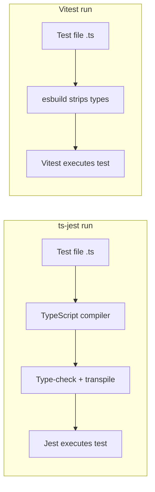
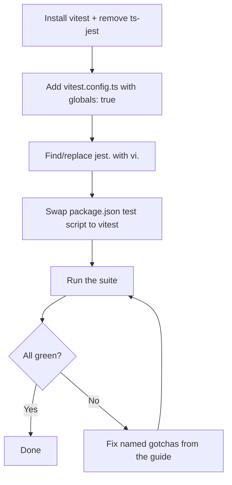

 
Every frontend team has the ticket. "Evaluate moving off ts-jest." It rots in the backlog for a year. Nobody picks it up, because everyone assumes a test-runner swap means rewriting hundreds of files.
 
It doesn't. Vitest ships a Jest-compatible API on purpose, so the switch stays cheap. The [official migration guide](https://vitest.dev/guide/migration.html#jest) is short, and most of it covers edge cases you may never hit. The common path is one config file, a find-and-replace, and a green run. The risk you picture is bigger than the risk that's there. The reward, faster tests, is the part you keep ignoring.
 
## Why ts-jest got slow
 
Start with the pain, since it's the reason to move.
 
ts-jest is a Jest transformer. On every run it hands each file to the TypeScript compiler to type-check and transpile. That work is correct and thorough and slow. The compiler resolves types across your whole project before one assertion fires.
 
The usual fix proves the point. You reach for [`isolatedModules: true`](https://kulshekhar.github.io/ts-jest/docs/getting-started/options/isolatedModules), which skips type-checking and compiles each file alone. On our own codebase, turning it on in `tsconfig` cut a full-suite run from 16 minutes to about 3. But look at what you did. You switched off the type-checking that justified ts-jest's cost, and you gave up features like `const enum`. So a tuned ts-jest setup runs no type-checking in tests and still trails the alternative. That is the bottleneck.
 
Vitest attacks it differently. It reuses Vite's pipeline, which strips types with esbuild. esbuild is written in Go and transpiles TypeScript far faster than the TypeScript compiler — [benchmarks](https://datastation.multiprocess.io/blog/2021-11-13-benchmarking-esbuild-swc-typescript-babel.html) put it anywhere from several times to tens of times quicker, depending on the project. It strips types instead of understanding them. You add no separate transform, no Babel preset. TypeScript works because the build tool already reads it.
 

 
One pipeline does less, and it skips the costly part.
 
## It's compatible on purpose
 
Teams treat Vitest as a foreign framework. It isn't.
 
The API matches Jest. `describe`, `it`, `test`, `expect`, `beforeEach`, `afterEach` — same names, same shapes. Matchers like `toBe`, `toEqual`, and `toHaveBeenCalledWith` carry over. Set one flag, `globals: true`, and tests that call `describe` and `expect` without imports keep running. The [globals setting](https://vitest.dev/config/globals) exists so you skip adding an import to every file on day one.
 
That flag is why this is find-and-replace, not a rewrite. Your test bodies mostly hold. The plumbing around them moves.
 
## What actually changes
 
Three things move. None is scary.
 
First, the config. You write a small `vitest.config.ts`. If you build with Vite, you extend what you have.
 
```ts
// vitest.config.ts
import { defineConfig } from 'vitest/config'
 
export default defineConfig({
  test: {
    globals: true,        // keep Jest-style describe/expect without imports
    environment: 'jsdom', // for component tests; omit for pure Node code
  },
})
```
 
Second, `jest` becomes `vi`. Vitest names the mocking object `vi`. This is most of your diff, and it's mechanical.
 
```ts
// before (ts-jest / Jest)
jest.mock('./api')
const spy = jest.fn()
jest.useFakeTimers()
jest.spyOn(obj, 'method')
 
// after (Vitest)
import { vi } from 'vitest'
vi.mock('./api')
const spy = vi.fn()
vi.useFakeTimers()
vi.spyOn(obj, 'method')
```
 
Find `jest.`, replace with `vi.`, add the import or skip it with `globals: true`. A codemod clears a large suite in one sitting.
 
Third, a few named quirks. The guide lists them. `jest.requireActual` becomes `vi.importActual`. `jest.setTimeout(5000)` becomes `vi.setConfig({ testTimeout: 5000 })`. The `jest.Mock` type becomes an imported `Mock` from `vitest`.
 
## Run it in an afternoon
 

 
Install Vitest and drop ts-jest and its presets. Add the config. Replace `jest.` with `vi.`. Point the `test` script at `vitest`. Run it. Fix the short list of documented differences below.
 
The failure mode isn't "my tests are broken forever." It's a green run after a handful of named fixes.
 
## The Gotchas Worth Knowing
 
A few differences bite if you don't know them. Two cause *silently wrong* tests, not loud errors — so here's the exact shape.
 
- **`mockReset`:** Jest empties the implementation. Vitest [restores the original](https://vitest.dev/guide/migration.html#mock-mockreset) you passed to `vi.fn(impl)`.
  ```ts
  const fn = vi.fn(() => 'real')
  fn.mockReset()
  fn()            // Vitest → 'real'   |   Jest → undefined
  ```
 
- **Module mock factories:** In Jest the factory returns the default export. In Vitest it must return an object with each export named, including `default`.
  ```ts
  // Jest
  jest.mock('./greet', () => 'hello')
 
  // Vitest
  vi.mock('./greet', () => ({ default: 'hello' }))
  ```
 
- **Timers & legacy callbacks:** Vitest drops Jest's legacy fake timers and the `done` callback. Rewrite those as `async`/`await` or a Promise.
- **Version floor:** Vitest 4 needs Vite 6 and Node 20 or newer, per the [migration guide](https://vitest.dev/guide/migration.html#vitest-4). Check your runtime first.
Each is a line in a checklist. Keep the guide open during the swap and clear them as they appear.
 
## The bottom line
 
The reason to move is speed. ts-jest either type-checks and crawls, or skips it and still trails esbuild. esbuild strips types in Go, not JavaScript — on a large suite that's the difference between a coffee break and a glance. The reason you can move is compatibility: Vitest copied Jest's API, so your tests survive the trip.
 
The ticket is smaller than its reputation. You rename `jest` to `vi`, add one config file, and work a short list of gotchas. Do it on a quiet afternoon. Then keep the faster feedback loop all year.