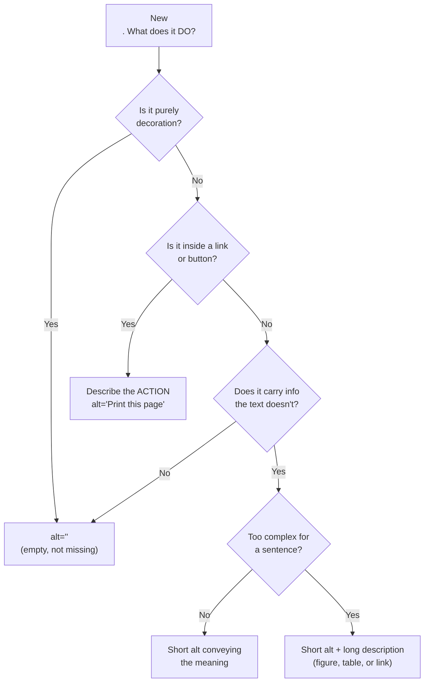

<h2 id="o-the-mistake">The mistake I kept making</h2>

A confession: early in my career, my images shipped with no `alt` text at all. If an image mattered, I gave it a visible caption and moved on (I thought `alt` was a box the SEO people cared about). Screen reader users got silence, or file names — "hero underscore final underscore v three dot jaypeg."

A caption doesn't substitute. It describes the image for everyone, but leaves the `` itself unnamed, and it can't say whether that image is a link, a chart, or wallpaper. I didn't know that then. I'm not sure I'd heard of a screen reader.

The usual penance, once you learn better, is to overcorrect: describe *everything*, decorative swooshes included. That's the opposite failure. The [W3C Images Tutorial](https://www.w3.org/WAI/tutorials/images/) says decorative images should get a null alternative — `alt=""` — so assistive technology skips them. Silence where there should be words, then words where there should be silence.

The lesson took years to sink in. The hard part of image accessibility isn't writing the description. It's deciding whether one should exist and what job it must do. Wording comes last. Classification comes first. Most of us skip to the last step.

<h2 id="o-the-question">The question that fixes most alt text</h2>

Before you touch the `alt` attribute, ask: **what does this image *do* on this page?**

Not "what does it show". A photo of a woman smiling at a laptop *shows* that. What it *does* might be nothing (stock decoration), navigation (it links to her profile), or information (the article is about her).

Same pixels. Three alt texts. One is empty.

[WCAG Success Criterion 1.1.1](https://www.w3.org/WAI/WCAG22/Understanding/non-text-content.html) requires text alternatives that serve "the equivalent purpose" of the content. Purpose, not appearance. The spec has said so since [WCAG 1.0 in 1999](https://www.w3.org/TR/WCAG10/). We still write alt text that describes what marketing exported from Figma.

<h2 id="o-three-roles">The three types of alt text: decorative, functional, informative</h2>

The [WAI Images Tutorial](https://www.w3.org/WAI/tutorials/images/) sorts images into categories. Three cover almost everything you'll ship: decorative, functional, informative.

**Decorative** — visual polish, no information. Empty `alt`, move on:

```html
<!-- A wave divider between page sections -->

```

*`alt=""` tells screen readers to skip it. Omitting the attribute is worse — [MDN warns](https://developer.mozilla.org/en-US/docs/Web/HTML/Reference/Elements/img) some screen readers then announce the file name. That's how users end up hearing "wave hyphen divider dot ess vee gee".*

**Functional** — the image is a control. Describe the action, not the picture:

```html
<!-- Bad: describes the pixels -->
<a href="/print"></a>

<!-- Good: describes the job -->
<a href="/print"></a>
```

*The alt text becomes the link's name. "An icon of a printer" tells users what your designer drew. "Print this page" tells them what Enter does. Only one helps mid-task.*

**Informative** — the image carries meaning the text doesn't. Convey it, briefly:

```html
<p>Attach the strap using the D-ring on the left side.</p>

```

*The alt completes the instruction. It doesn't repeat the paragraph, and it doesn't start with "Image of" — the screen reader announces that already.*

A fourth case: **complex images** — charts, infographics — where a short alt can't hold the data. Give a short `alt` plus a long description nearby:

```html
<figure>
  
  <figcaption>
    Q2 signups: April 1,240 · May 1,610 · June 2,380
  </figcaption>                                                                                                                      
</figure>
```

*The `alt` names the chart; the `figcaption` carries the numbers.*

A self-test from [MDN](https://developer.mozilla.org/en-US/docs/Web/HTML/Reference/Elements/img): read the alt text aloud with the paragraph before it. If the pair conveys what a sighted reader gets, stop. If it repeats or leaves a hole, keep editing.

<h2 id="o-decision-tree">The alt text decision tree</h2>

The W3C's [alt decision tree](https://www.w3.org/WAI/tutorials/images/decision-tree/) formalizes this. I run a simplified version on every ``:



No box says "describe what the image looks like". Appearance matters only when appearance *is* the information — a painting on a gallery site, a rash on a medical page, a mockup in a design critique.

<h2 id="o-ai-cant-classify">Why AI-generated alt text fails</h2>

In 2026, every CMS and editor plugin will generate alt text for you. The models describe pixels well. I use them. But the first three branches of the tree above have nothing to do with pixels.

Is the image decorative? Depends on the page. Functional? Depends on the markup around it. Does it add information? Depends on the text. A model looking at a cropped file sees none of that. It answers the one question it can — "what's in this picture?" — which is the last question that matters, and often the wrong one.

Researchers have documented the failure. [Silktide found](https://silktide.com/blog/the-downsides-of-ai-alt-text/) that screen reader users can tell when alt text is AI-generated: accurate descriptions that convey no purpose or function. The [American Foundation for the Blind](https://afb.org/blog/entry/alt-text-age-ai) puts it plainly: description without intent isn't access.

Picture a CMS plugin writing `alt="A person holding a credit card near a laptop"` for a checkout help page. Accurate. Useless. The image is a *button* opening the payment FAQ. Screen reader users get stock-photo narration and no hint the thing is clickable. Arguably worse than no alt at all, because it *sounds* finished.

My rule: AI drafts wording on informative images after I classify them. It never decides the role. That's a design decision, and it belongs to someone who can see the whole page (in every sense).

<h2 id="o-one-in-six">Missing alt text by the numbers (WebAIM 2026)</h2>

WCAG has required text alternatives since 1999, so you might expect the problem solved. The [2026 WebAIM Million report](https://webaim.org/projects/million/) — an automated audit of the top million home pages — found:

- **16.2% of home page images** lack alternative text (about 10.8 per page)
- **45% of those** sit inside links — links with no name
- Home pages average **66.6 images**, nearly double eight years ago
- Missing alt text stays among the six error types making up **96% of detected failures**, unchanged for seven years

The second bullet is the bad one. A missing alt on decoration is noise. A missing alt on a *linked* image is a door with no handle — the screen reader announces a raw URL, or nothing. Half our missing-alt problem is the highest-stakes category with the easiest fix.

We ship more images than ever and classify fewer. The tools improved. The thinking didn't.

<h2 id="o-describe-less">Describe less, decide more</h2>

Alt text quality is decided before you write a word. Classify first: decorative, functional, informative, complex. The [decision tree](https://www.w3.org/WAI/tutorials/images/decision-tree/) makes the decision for you. Wording is the easy 20%.

Next PR with images: don't ask "does this have alt text?". Ask "does this alt text know what the image is for?". The first is a checkbox. The second is accessibility. Otherwise you're hanging masterpieces in the gallery and labeling them `IMG_4032.JPG`.

Happy (inclusive) building! 